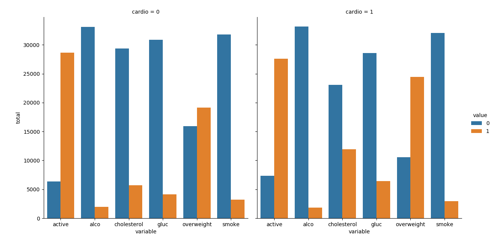
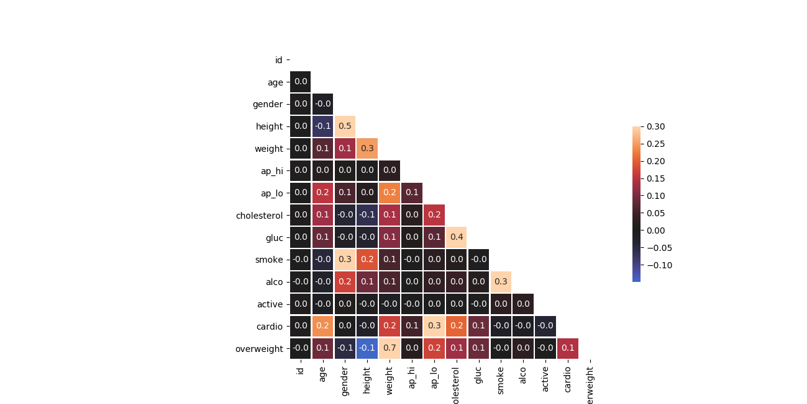
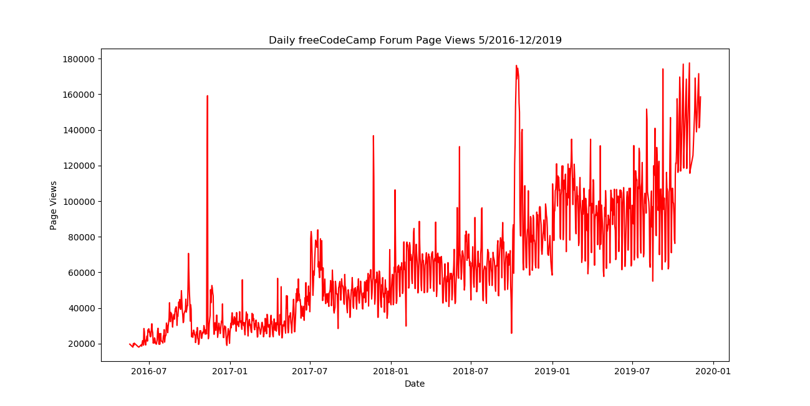
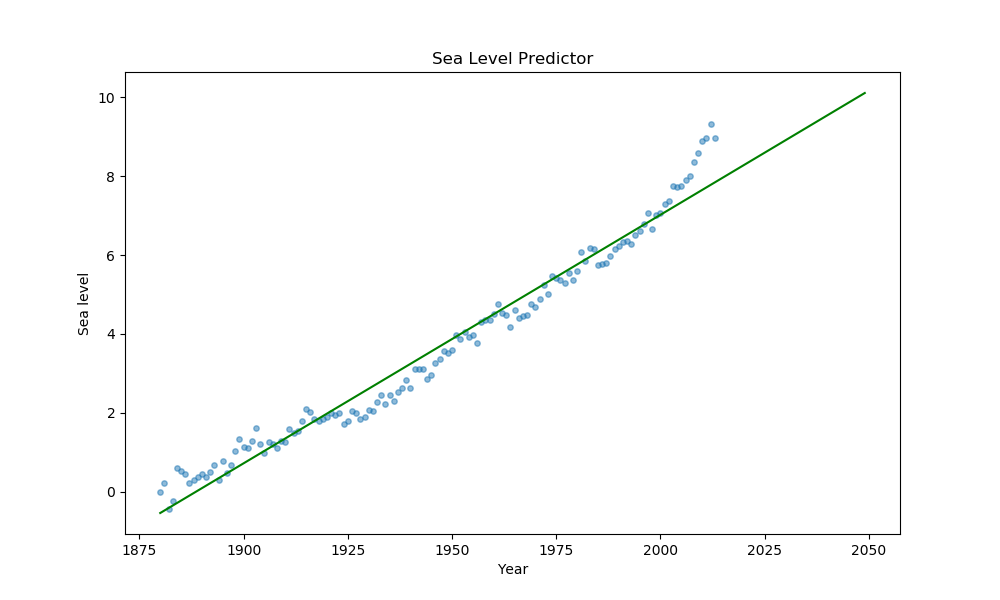

# Data Analysis with Python

This repository contains the solutions to the [Data Analysis with Python](https://www.freecodecamp.org/learn/data-analysis-with-python/data-analysis-with-python-course/introduction-to-data-analysis) certification projects offered by FreeCodeCamp.

The certification consists of 300 hours video lectures on Jupyter Notebooks, Numpy, Pandas, Data visualizations using Matplotlib, Seaborn and 5 Data Analysis projects.

### Projects:

3. Medical Data Visualizer : (medical_data_visualizer.py)  
This project involves data cleaning and visualizing medical examination data using matplotlib, seaborn, and pandas. (categorizing and cleaning data, categorical plots and heatmaps)  
Dataset: data/medical_examination.csv  
Result: 

  
4. Page View Time Series Visualizer : (pageView_timeSeries_visualizer.py)  
This project involves time series data visualization using line chart, bar chart, and box plots.  
Dataset: data/fcc-forum-pageviews.csv  
Result: 

5. Sea Level Predictor : (sea_level_predictor.py)  
This project involves analyzing a dataset of the global average sea level change since 1880 and predicting the sea level change through year 2050. (makes use of linear regression to predict the rise in sea level in 2050)  
Dataset: data/epa-sea-level.csv  
Result: 

Upon completion, you are eligible to get the certificate as below:  
[My certifications](Plots/da_python.png)
